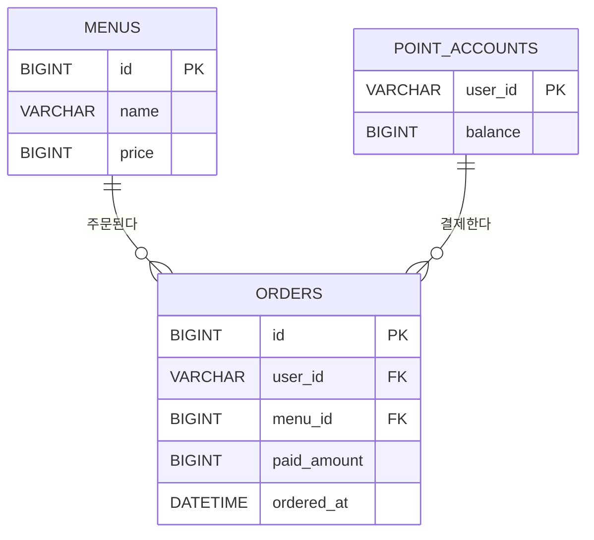

# ERD

## 1. 문서 범위

이 문서는 `docs/PRD.md`의 `원 과제 최소·제출 요구사항` 절과 P0 데이터 모델, 관계, 타입, 제약과 인덱스를
정의한다. MySQL을 메뉴, 포인트와 주문의 단일 원본으로 사용하며 Redis는 재구성 가능한 인기 메뉴 조회 모델로만
사용한다.

### 요구사항 추적

| 요구사항 | MySQL 원본 | 파생 데이터 |
| --- | --- | --- |
| MENU-01 메뉴 목록 조회 | `menus` | 없음 |
| POINT-01 포인트 충전 | `point_accounts` | 없음 |
| ORDER-01 주문·결제 | `menus`, `point_accounts`, `orders` | 주문 완료 이벤트 |
| EVENT-01 주문 데이터 전송 | `orders` | Kafka `order.completed` |
| POPULAR-01 인기 메뉴 조회 | `orders`, `menus` | Redis 일자별 Sorted Set |

## 2. 설계 원칙

- 사용자 식별값은 외부에서 발급되므로 P0에 `users` 테이블을 만들지 않는다.
- 포인트 계정은 외부 사용자 식별값을 자연키로 사용하여 사용자별 행 하나를 보장한다.
- 성공한 주문만 `orders`에 저장한다. 주문 생성과 포인트 차감이 실패하면 주문 행을 남기지 않는다.
- 하나의 주문은 메뉴 한 잔만 포함하므로 `order_items` 테이블을 만들지 않는다.
- 결제 수단은 포인트 하나이며 취소·환불이 없으므로 별도 `payments`와 주문 상태 컬럼을 만들지 않는다.
- 포인트 원장은 P0 제외 범위이므로 충전 이력 테이블을 만들지 않고 현재 잔액만 저장한다.
- 주문에는 메뉴의 현재 가격과 별개로 결제 당시 가격을 저장한다.
- 숫자 surrogate PK는 `BIGINT AUTO_INCREMENT`를 사용하고 금액과 포인트는 signed `BIGINT`를 사용한다.
- 모든 영속 시각은 UTC로 생성하고 읽는다.

## 3. 관계도

## 4. MySQL schema

MySQL 8.0.16 이상을 기준으로 하며 `CHECK` 제약이 실제로 적용되어야 한다. 테이블과 컬럼은
`snake_case`를 사용한다.

### 4.1 `menus`

메뉴 목록의 원본이다. P0에는 메뉴 관리 API가 없으며 초기 데이터는 migration으로 입력한다.

| 컬럼 | 타입 | NULL | 키·기본값 | 설명 |
| --- | --- | --- | --- | --- |
| `id` | `BIGINT` | N | PK, AUTO_INCREMENT | 메뉴 식별값 |
| `name` | `VARCHAR(100)` | N |  | 메뉴 이름 |
| `price` | `BIGINT` | N |  | 원 단위 가격이며 같은 수의 포인트가 필요함 |

#### 제약

| 이름 | 정의 | 목적 |
| --- | --- | --- |
| `pk_menus` | `PRIMARY KEY (id)` | 메뉴 식별 |
| `chk_menus_name_not_blank` | `CHECK (CHAR_LENGTH(TRIM(name)) > 0)` | 빈 메뉴 이름 방지 |
| `chk_menus_price_positive` | `CHECK (price > 0)` | 0원 이하 가격 방지 |

메뉴 이름의 고유성은 요구사항에 없으므로 UNIQUE 제약을 두지 않는다.

### 4.2 `point_accounts`

사용자별 현재 포인트 잔액의 원본이다. 외부 회원 시스템의 사용자 등록 과정에서 잔액 0으로 행을 만든다.
P0 애플리케이션은 회원가입 API를 구현하지 않는다.

| 컬럼 | 타입 | NULL | 키·기본값 | 설명 |
| --- | --- | --- | --- | --- |
| `user_id` | `VARCHAR(64)` | N | PK | 외부 사용자 식별값 |
| `balance` | `BIGINT` | N | DEFAULT 0 | 현재 포인트 잔액 |

`user_id`는 `utf8mb4_0900_bin` collation으로 대소문자를 구분한다. FK 컬럼도 같은 문자 집합과 collation을
사용한다.

#### 제약

| 이름 | 정의 | 목적 |
| --- | --- | --- |
| `pk_point_accounts` | `PRIMARY KEY (user_id)` | 사용자별 계정 하나와 잠금 대상 보장 |
| `chk_point_accounts_balance_non_negative` | `CHECK (balance >= 0)` | 음수 잔액 방지 |

별도 surrogate key와 `version` 컬럼은 두지 않는다. 포인트 계정은 `user_id` PK로 직접 조회하여
`SELECT ... FOR UPDATE` 비관적 잠금을 획득한다.

### 4.3 `orders`

포인트 결제가 완료된 주문의 원본이다. 실패하거나 rollback된 주문은 저장하지 않는다.

| 컬럼 | 타입 | NULL | 키·기본값 | 설명 |
| --- | --- | --- | --- | --- |
| `id` | `BIGINT` | N | PK, AUTO_INCREMENT | 주문 식별값 |
| `user_id` | `VARCHAR(64)` | N | FK | 주문 사용자와 결제 포인트 계정 |
| `menu_id` | `BIGINT` | N | FK | 주문한 메뉴 |
| `paid_amount` | `BIGINT` | N |  | 결제 당시 메뉴 가격과 차감 포인트 |
| `ordered_at` | `DATETIME(6)` | N |  | 주문 완료 UTC 시각 |

#### 제약

| 이름 | 정의 | 목적 |
| --- | --- | --- |
| `pk_orders` | `PRIMARY KEY (id)` | 주문 식별 |
| `fk_orders_point_account` | `FOREIGN KEY (user_id) REFERENCES point_accounts(user_id)` | 결제 계정 참조 무결성 |
| `fk_orders_menu` | `FOREIGN KEY (menu_id) REFERENCES menus(id)` | 메뉴 참조 무결성 |
| `chk_orders_paid_amount_positive` | `CHECK (paid_amount > 0)` | 0 이하 결제 금액 방지 |

두 FK는 `ON UPDATE RESTRICT ON DELETE RESTRICT`를 사용한다. 주문이 참조하는 사용자 식별값이나 메뉴를
변경·삭제하여 이력을 훼손하지 않는다.

#### 인덱스

| 이름 | 컬럼 | 목적 |
| --- | --- | --- |
| `idx_orders_user_id` | `(user_id)` | 포인트 계정 FK와 사용자 기준 참조 지원 |
| `idx_orders_menu_id` | `(menu_id)` | 메뉴 FK 지원 |
| `idx_orders_ordered_at_menu_id` | `(ordered_at, menu_id)` | 최근 UTC 기간의 MySQL 인기 집계 지원 |

`idx_orders_ordered_at_menu_id`는 P2 fallback에서 직접 사용하지만 MySQL이 최종 원본이라는 P0 모델에도
포함한다. 별도 인기 집계 테이블은 만들지 않는다.

## 5. 트랜잭션과 동시성 불변식

### 5.1 사전 생성된 포인트 계정의 충전

외부 회원 시스템의 사용자 등록 과정에서 `point_accounts` 행을 잔액 0으로 생성한다. 충전은 다음 순서를 사용한다.

1. `point_accounts.user_id` 행을 `SELECT ... FOR UPDATE`로 조회한다.
2. checked arithmetic으로 충전 후 잔액을 계산하고 갱신한다.
3. 트랜잭션을 commit한다.

포인트 계정이 없으면 회원 시스템과의 데이터 정합성이 깨진 것이므로 충전은 실패한다. PK 제약과 DB 잠금이 모든
인스턴스에 공통으로 적용되므로 동시 충전이 유실되지 않는다.

### 5.2 주문과 결제

하나의 주문 트랜잭션은 다음 불변식을 지킨다.

1. 메뉴와 결제 당시 가격을 조회한다.
2. `point_accounts.user_id` 행을 `SELECT ... FOR UPDATE`로 잠근다.
3. `balance >= menus.price`를 확인한다.
4. 잔액 차감과 `orders` insert를 같은 트랜잭션에서 실행한다.
5. 둘 중 하나라도 실패하면 전체를 rollback한다.
6. commit된 `orders.ordered_at`을 Kafka 이벤트 `occurredAt`에 그대로 사용한다.

같은 사용자의 충전과 주문은 동일한 포인트 계정 행을 잠그므로 여러 서버와 인스턴스에서도 직렬화된다.
JVM 로컬 락, `synchronized`, Redis와 Kafka는 포인트·주문 정합성에 사용하지 않는다.

### 5.3 시간 저장

`DATETIME(6)`에는 timezone 정보가 없으므로 애플리케이션, JDBC와 MySQL session timezone을 UTC로 고정한다.
애플리케이션은 `Instant` 등 UTC 기준 값을 사용하고 로컬 기본 timezone에 의존하지 않는다.

인기 집계의 기간 경계는 조회 UTC 날짜가 `D`일 때 `[D-6 00:00:00Z, D+1 00:00:00Z)`다.

## 6. Redis 인기 메뉴 조회 모델

Redis 데이터는 MySQL `orders`에서 재구성할 수 있는 파생 데이터이며 ERD의 영속 엔티티가 아니다.

| 항목 | 계약 |
| --- | --- |
| 자료구조 | Sorted Set |
| key | `popular:menu:<yyyy-MM-dd>` |
| 날짜 기준 | Kafka 이벤트 `occurredAt`의 UTC 날짜 |
| member | 10진 문자열로 표현한 `menu_id` |
| score | 해당 UTC 날짜의 결제 완료 주문 수 |
| 갱신 | Kafka consumer가 `ZINCRBY 1 <menuId>` 실행 |
| 만료 | 해당 날짜 `D`의 `D+8 00:00:00Z`에 만료 |
| 조회 범위 | 조회일 포함 최근 7개 UTC 날짜의 key |
| 정렬 | 합산 score 내림차순, 동점이면 `menu_id` 오름차순, 최대 3개 |

P0의 Redis 연결·조회 장애는 `POPULAR_MENU_UNAVAILABLE`로 실패 처리한다. 정상 응답에서 누락된 key는 주문이
없는 것으로 간주하며 P0는 데이터 유실을 자동 탐지하지 않는다. MySQL fallback과 Redis 재구성은 P2 M8에서
도입한다.

## 7. P0에 만들지 않는 모델

| 제외 모델 | 제외 이유 | 도입 단계 또는 조건 |
| --- | --- | --- |
| `users` | 외부 사용자 식별값을 사용하고 인증·회원 기능이 없음 | 인증·사용자 관리 도입 시 |
| `point_transactions` | 포인트 원장과 충전 이력이 P0 제외 범위 | 감사 추적 또는 원장 도입 시 |
| `order_items` | 주문 하나가 메뉴 한 잔만 포함 | 여러 메뉴·수량 도입 시 |
| `payments` | 결제 수단이 포인트 하나이고 취소·환불이 없음 | 복수 결제·취소·환불 도입 시 |
| `outbox_events` | P0는 commit 후 Kafka 발행을 한 번 시도 | P1 M5 |
| consumer 중복 기록 | P0는 Kafka 중복 소비 방지를 지원하지 않음 | P1 M7 |
| 인기 집계 테이블 | Redis가 조회 모델이고 MySQL 주문에서 재집계 가능 | 성능 측정 후 필요할 때 |
