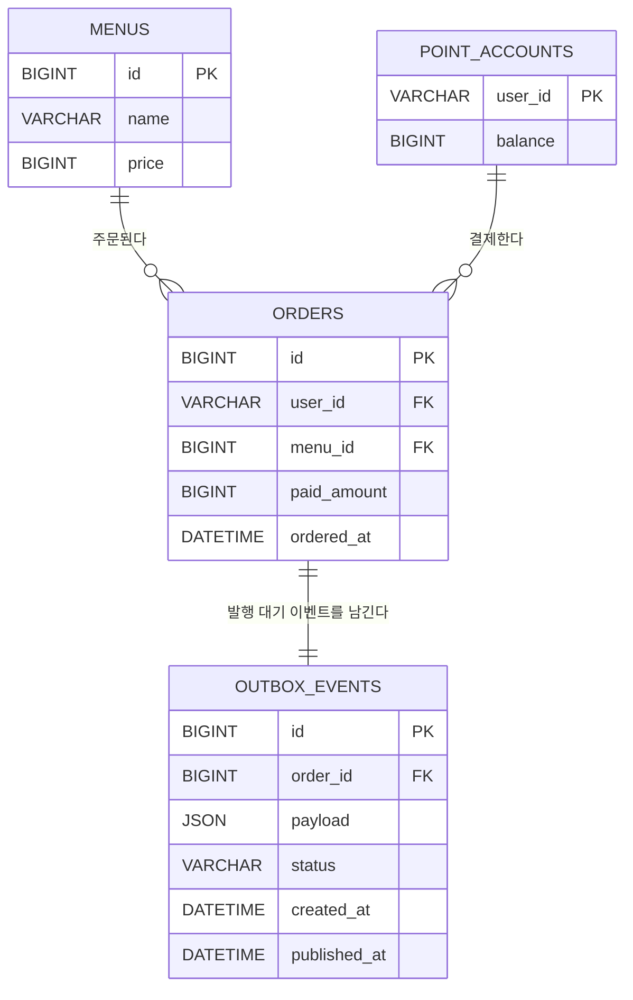

# ERD

## 1. 문서 범위

이 문서는 `docs/PRD.md`의 `원 과제 최소·제출 요구사항` 절, P0 데이터 모델과 P1 M5 Transactional Outbox,
P1 M7 consumer 중복 처리의 관계, 타입, 제약과 인덱스를 정의한다. MySQL을 메뉴, 포인트와 주문의 단일 원본으로
사용하며 Redis는 재구성 가능한 인기 메뉴 조회 모델로만 사용한다.

### 요구사항 추적

| 요구사항 | MySQL 원본 | 파생 데이터 |
| --- | --- | --- |
| MENU-01 메뉴 목록 조회 | `menus` | 없음 |
| POINT-01 포인트 충전 | `point_accounts` | 없음 |
| ORDER-01 주문·결제 | `menus`, `point_accounts`, `orders` | 주문 완료 이벤트 |
| EVENT-01 주문 데이터 전송 | `orders` | Kafka `order.completed` |
| POPULAR-01 인기 메뉴 조회 | `orders`, `menus` | Redis 일자별 Sorted Set |
| P1 M5 Transactional Outbox 저장 | `orders`, `outbox_events` | `order.completed` 발행 대기·완료 상태 |
| P1 M7 consumer 중복 처리 | `orders`, `outbox_events` | Redis 처리 표식과 일자별 Sorted Set |

## 2. 설계 원칙

- 사용자 식별값은 외부에서 발급되므로 P0에 `users` 테이블을 만들지 않는다.
- 포인트 계정은 외부 사용자 식별값을 자연키로 사용하여 사용자별 행 하나를 보장한다.
- 성공한 주문만 `orders`에 저장한다. 주문 생성과 포인트 차감이 실패하면 주문 행을 남기지 않는다.
- 하나의 주문은 메뉴 한 잔만 포함하므로 `order_items` 테이블을 만들지 않는다.
- 결제 수단은 포인트 하나이며 취소·환불이 없으므로 별도 `payments`와 주문 상태 컬럼을 만들지 않는다.
- 포인트 원장은 P0 제외 범위이므로 충전 이력 테이블을 만들지 않고 현재 잔액만 저장한다.
- 주문에는 메뉴의 현재 가격과 별개로 결제 당시 가격을 저장한다.
- 숫자 surrogate PK는 `BIGINT AUTO_INCREMENT`를 사용하고 금액과 포인트는 signed `BIGINT`를 사용한다.
- 모든 영속 시각은 UTC로 생성하고 읽는다.
- P1 M5에서는 주문 완료 이벤트의 발행 시점 데이터를 JSON 스냅샷으로 저장한다. 발행 대기와 완료 상태만 저장하며,
  재시도 횟수와 실패 원인은 M6의 범위다.
- P1 M7은 `orderId`를 소비 중복 기준으로 사용한다. MySQL 소비 기록 테이블을 만들지 않고 Redis 처리 표식과
  인기 메뉴 점수를 같은 원자 스크립트에서 갱신한다.

## 3. 관계도



## 4. MySQL schema

MySQL 8.0.16 이상을 기준으로 하며 `CHECK` 제약이 실제로 적용되어야 한다. 테이블과 컬럼은
`snake_case`를 사용한다.

### 4.1 `menus`

메뉴 목록의 원본이다. P0에는 메뉴 관리 API가 없으며 초기 데이터는 migration으로 입력한다.

| 컬럼 | 타입 | NULL | 키·기본값 | 설명 |
| --- | --- | --- | --- | --- |
| `id` | `BIGINT` | N | PK, AUTO_INCREMENT | 메뉴 식별값 |
| `name` | `VARCHAR(100)` | N |  | 메뉴 이름 |
| `price` | `BIGINT` | N |  | 원 단위 가격이며 같은 수의 포인트가 필요함 |

#### 제약

| 이름 | 정의 | 목적 |
| --- | --- | --- |
| `pk_menus` | `PRIMARY KEY (id)` | 메뉴 식별 |
| `chk_menus_name_not_blank` | `CHECK (CHAR_LENGTH(TRIM(name)) > 0)` | 빈 메뉴 이름 방지 |
| `chk_menus_price_positive` | `CHECK (price > 0)` | 0원 이하 가격 방지 |

메뉴 이름의 고유성은 요구사항에 없으므로 UNIQUE 제약을 두지 않는다.

### 4.2 `point_accounts`

사용자별 현재 포인트 잔액의 원본이다. 외부 회원 시스템의 사용자 등록 과정에서 잔액 0으로 행을 만든다.
P0 애플리케이션은 회원가입 API를 구현하지 않는다.

| 컬럼 | 타입 | NULL | 키·기본값 | 설명 |
| --- | --- | --- | --- | --- |
| `user_id` | `VARCHAR(64)` | N | PK | 외부 사용자 식별값 |
| `balance` | `BIGINT` | N | DEFAULT 0 | 현재 포인트 잔액 |

`user_id`는 `utf8mb4_0900_bin` collation으로 대소문자를 구분한다. FK 컬럼도 같은 문자 집합과 collation을
사용한다.

#### 제약

| 이름 | 정의 | 목적 |
| --- | --- | --- |
| `pk_point_accounts` | `PRIMARY KEY (user_id)` | 사용자별 계정 하나와 잠금 대상 보장 |
| `chk_point_accounts_balance_non_negative` | `CHECK (balance >= 0)` | 음수 잔액 방지 |

별도 surrogate key와 `version` 컬럼은 두지 않는다. 포인트 계정은 `user_id` PK로 직접 조회하여
`SELECT ... FOR UPDATE` 비관적 잠금을 획득한다.

### 4.3 `orders`

포인트 결제가 완료된 주문의 원본이다. 실패하거나 rollback된 주문은 저장하지 않는다.

| 컬럼 | 타입 | NULL | 키·기본값 | 설명 |
| --- | --- | --- | --- | --- |
| `id` | `BIGINT` | N | PK, AUTO_INCREMENT | 주문 식별값 |
| `user_id` | `VARCHAR(64)` | N | FK | 주문 사용자와 결제 포인트 계정 |
| `menu_id` | `BIGINT` | N | FK | 주문한 메뉴 |
| `paid_amount` | `BIGINT` | N |  | 결제 당시 메뉴 가격과 차감 포인트 |
| `ordered_at` | `DATETIME(6)` | N |  | 주문 완료 UTC 시각 |

#### 제약

| 이름 | 정의 | 목적 |
| --- | --- | --- |
| `pk_orders` | `PRIMARY KEY (id)` | 주문 식별 |
| `fk_orders_point_account` | `FOREIGN KEY (user_id) REFERENCES point_accounts(user_id)` | 결제 계정 참조 무결성 |
| `fk_orders_menu` | `FOREIGN KEY (menu_id) REFERENCES menus(id)` | 메뉴 참조 무결성 |
| `chk_orders_paid_amount_positive` | `CHECK (paid_amount > 0)` | 0 이하 결제 금액 방지 |

두 FK는 `ON UPDATE RESTRICT ON DELETE RESTRICT`를 사용한다. 주문이 참조하는 사용자 식별값이나 메뉴를
변경·삭제하여 이력을 훼손하지 않는다.

#### 인덱스

| 이름 | 컬럼 | 목적 |
| --- | --- | --- |
| `idx_orders_user_id` | `(user_id)` | 포인트 계정 FK와 사용자 기준 참조 지원 |
| `idx_orders_menu_id` | `(menu_id)` | 메뉴 FK 지원 |
| `idx_orders_ordered_at_menu_id` | `(ordered_at, menu_id)` | 최근 UTC 기간의 MySQL 인기 집계 지원 |

`idx_orders_ordered_at_menu_id`는 P2 fallback에서 직접 사용하지만 MySQL이 최종 원본이라는 P0 모델에도
포함한다. 별도 인기 집계 테이블은 만들지 않는다.

### 4.4 `outbox_events`

P1 M5에서 주문 완료 이벤트를 주문 트랜잭션과 원자적으로 저장하는 Outbox다. 이 단계에서는
`order.completed`만 저장하므로 범용 이벤트 유형, 재시도 횟수와 실패 원인을 추가하지 않는다.

| 컬럼 | 타입 | NULL | 키·기본값 | 설명 |
| --- | --- | --- | --- | --- |
| `id` | `BIGINT` | N | PK, AUTO_INCREMENT | Outbox 이벤트 식별값 |
| `order_id` | `BIGINT` | N | FK, UNIQUE | 이벤트를 만든 주문 ID |
| `payload` | `JSON` | N |  | Kafka `order.completed` 계약 전체의 생성 시점 스냅샷 |
| `status` | `VARCHAR(20)` | N |  | `PENDING` 또는 `PUBLISHED` |
| `created_at` | `DATETIME(6)` | N |  | 주문과 함께 생성한 UTC 시각 |
| `published_at` | `DATETIME(6)` | Y |  | Kafka 1회 발행 성공 후 `PUBLISHED`로 전이한 UTC 시각 |

#### 제약

| 이름 | 정의 | 목적 |
| --- | --- | --- |
| `pk_outbox_events` | `PRIMARY KEY (id)` | Outbox 이벤트 식별 |
| `uk_outbox_events_order_id` | `UNIQUE (order_id)` | 주문 하나당 주문 완료 이벤트 하나 보장 |
| `fk_outbox_events_order` | `FOREIGN KEY (order_id) REFERENCES orders(id)` | 존재하는 주문의 이벤트만 저장 |
| `chk_outbox_events_status` | `CHECK (status IN ('PENDING', 'PUBLISHED'))` | M5 상태 전이 범위 강제 |
| `chk_outbox_events_status_published_at` | 아래 상태·시각 조합 검사 | 상태와 발행 시각 조합의 정합성 강제 |

`chk_outbox_events_status_published_at`의 정의는 다음과 같다.

```sql
CHECK ((status = 'PENDING' AND published_at IS NULL) OR (status = 'PUBLISHED' AND published_at IS NOT NULL))
```

FK는 `ON UPDATE RESTRICT ON DELETE RESTRICT`를 사용한다.

#### 인덱스

| 이름 | 컬럼 | 목적 |
| --- | --- | --- |
| `idx_outbox_events_status_id` | `(status, id)` | M6에서 `PENDING` 이벤트를 식별하는 조회 지원 |

## 5. 트랜잭션과 동시성 불변식

### 5.1 사전 생성된 포인트 계정의 충전

외부 회원 시스템의 사용자 등록 과정에서 `point_accounts` 행을 잔액 0으로 생성한다. 충전은 다음 순서를 사용한다.

1. `point_accounts.user_id` 행을 `SELECT ... FOR UPDATE`로 조회한다.
2. checked arithmetic으로 충전 후 잔액을 계산하고 갱신한다.
3. 트랜잭션을 commit한다.

포인트 계정이 없으면 회원 시스템과의 데이터 정합성이 깨진 것이므로 충전은 실패한다. PK 제약과 DB 잠금이 모든
인스턴스에 공통으로 적용되므로 동시 충전이 유실되지 않는다.

### 5.2 주문과 결제

하나의 주문 트랜잭션은 다음 불변식을 지킨다.

1. 메뉴와 결제 당시 가격을 조회한다.
2. `point_accounts.user_id` 행을 `SELECT ... FOR UPDATE`로 잠근다.
3. `balance >= menus.price`를 확인한다.
4. 잔액 차감과 `orders` insert를 같은 트랜잭션에서 실행한다.
5. 둘 중 하나라도 실패하면 전체를 rollback한다.
6. commit된 `orders.ordered_at`을 Kafka 이벤트 `occurredAt`에 그대로 사용한다.

같은 사용자의 충전과 주문은 동일한 포인트 계정 행을 잠그므로 여러 서버와 인스턴스에서도 직렬화된다.
JVM 로컬 락, `synchronized`, Redis와 Kafka는 포인트·주문 정합성에 사용하지 않는다.

### 5.3 시간 저장

`DATETIME(6)`에는 timezone 정보가 없으므로 애플리케이션, JDBC와 MySQL session timezone을 UTC로 고정한다.
애플리케이션은 `Instant` 등 UTC 기준 값을 사용하고 로컬 기본 timezone에 의존하지 않는다.

인기 집계의 기간 경계는 조회 UTC 날짜가 `D`일 때 `[D-6 00:00:00Z, D+1 00:00:00Z)`다.

### 5.4 P1 M5 Transactional Outbox

P1 M5의 주문 트랜잭션은 P0 주문·결제 불변식에 다음을 추가한다.

1. `orders` insert와 같은 트랜잭션에서 `order_id`와 Kafka `order.completed` payload 스냅샷을 가진
   `outbox_events` 행을 `PENDING`으로 저장한다.
2. 포인트 차감, 주문 저장과 Outbox 저장 중 하나라도 실패하면 전체를 rollback한다.
3. M6 도입 뒤 commit 후 최초 Kafka 발행은 `AFTER_COMMIT` 리스너에서 별도 트랜잭션을 시작한다. 최초 발행과
   재시도는 모두 `FOR UPDATE SKIP LOCKED`로 Outbox 행을 잠그고 `PENDING` 상태를 확인한 뒤 payload를 Kafka에
   발행한다. 발행 성공 시 같은 별도 트랜잭션에서 Outbox 행을 `PUBLISHED`로 전이하고 `published_at`을 기록한다.
4. Kafka 발행 또는 상태 전이가 실패하면 Outbox 행은 `PENDING`으로 남긴다. M5는 자동 재시도를 실행하지 않고,
   M6이 이 행을 재시도한다.

Kafka 발행 성공 뒤 상태 전이가 실패하면 같은 이벤트의 재발행이 가능하다. M7에서 consumer 중복 처리를 도입하기
전까지 이 가능성을 제거하려고 JVM 로컬 상태나 분산 락을 추가하지 않는다.

### 5.5 P1 M6 Kafka 게시 재시도

M6 게시자는 모든 인스턴스에서 이전 실행 완료 뒤 1초를 기다리는 fixed delay로 실행한다. `idx_outbox_events_status_id`를
사용해 `PENDING` 행을 ID 오름차순으로 찾고, 후보 하나를 `SELECT ... FOR UPDATE SKIP LOCKED`로 잠근 뒤 상태를
다시 확인한다. 최초 발행도 같은 조회·상태 확인 경로를 사용한다. `AFTER_COMMIT` 최초 발행은 이미 종료된 주문
트랜잭션에 참여하면 상태 전이가 commit되지 않으므로, 별도 트랜잭션에서 이 경로를 실행한다. 잠긴 행은 기다리지 않고
건너뛰며 다음 주기에 다시 찾는다.

발행에 성공하면 같은 트랜잭션에서 `status`를 `PUBLISHED`로 바꾸고 `published_at`에 UTC 시각을 기록한다. Kafka
발행 완료와 producer의 메타데이터 대기는 합쳐 최대 5초로 제한한다. 발행 완료 대기 중 실패, 시간 초과 또는 상태 전이
실패 시 트랜잭션을 rollback하여 행을 `PENDING`과 `published_at = NULL`로 남긴다. 이 방식은 여러 인스턴스가 같은 행을
동시에 발행하지 않게 하지만, Kafka 발행 성공 뒤 DB 전이가 실패하면 다음 재시도에서 중복 발행할 수 있다. 이 중복의
consumer 부수 효과 방지는 M7에서 처리한다.

M6은 `PENDING`, `PUBLISHED` 외 상태, 재시도 횟수, 실패 원인과 dead-letter 모델을 추가하지 않는다.

### 5.6 P1 M7 Kafka consumer 중복 처리

`order.completed.orderId`는 주문 하나와 Outbox 이벤트 하나에 대응하므로 consumer의 중복 판단 키로 사용한다.
이 판단은 이벤트 schema를 바꾸지 않으며, `userId`, `menuId`, `paidAmount`, `occurredAt`을 조합하지 않는다.

consumer는 Redis Lua 스크립트 한 번으로 다음을 수행한다.

1. 이벤트 `occurredAt`의 UTC 날짜를 `D`로 계산하고, `D+8 00:00:00Z`가 지나지 않았는지 확인한다.
2. `popular:menu:processed:<yyyy-MM-dd>:<orderId>`를 `SET ... NX PXAT`으로 만든다.
3. 표식을 새로 만들었을 때만 같은 스크립트에서 `popular:menu:<yyyy-MM-dd>`에 `ZINCRBY 1 <menuId>`를 실행하고,
   두 key의 만료 시각을 `D+8 00:00:00Z`로 맞춘다.
4. 표식이 이미 있으면 점수를 변경하지 않고 중복 처리 결과를 반환한다.

Redis 스크립트 성공 뒤 Kafka offset commit 전에 중단되어 이벤트가 재전달되어도 표식이 남아 있어 점수는 다시
증가하지 않는다. Redis 오류로 스크립트가 완료되지 않으면 offset을 확정하지 않아 재전달로 다시 시도한다.
`D+8 00:00:00Z` 이후 도착한 이벤트는 이미 최근 7개 UTC 날짜 집계 대상 밖이므로 key를 만들지 않고 소비를
완료한다.

Redis와 MySQL은 하나의 원자 트랜잭션을 만들지 않는다. 따라서 Redis 데이터 유실 또는 개별 key eviction으로
표식과 점수가 사라지거나 불일치할 수 있으며, M7은 이를 감지하거나 보상하지 않는다. MySQL fallback, Redis
재구성과 유실 데이터 복구는 P2 M8에서 담당한다.

## 6. Redis 인기 메뉴 조회 모델

Redis 데이터는 MySQL `orders`에서 재구성할 수 있는 파생 데이터이며 ERD의 영속 엔티티가 아니다.

| 항목 | 계약 |
| --- | --- |
| 점수 자료구조 | Sorted Set |
| 점수 key | `popular:menu:<yyyy-MM-dd>` |
| 처리 표식 자료구조 | String, 값은 처리 여부만 나타내는 `1` |
| 처리 표식 key | `popular:menu:processed:<yyyy-MM-dd>:<orderId>` |
| 날짜 기준 | Kafka 이벤트 `occurredAt`의 UTC 날짜 |
| 점수 member | 10진 문자열로 표현한 `menu_id` |
| 점수 score | 해당 UTC 날짜의 결제 완료 주문 수 |
| 중복 판단 | 같은 `orderId`는 같은 이벤트 소비로 판단 |
| 갱신 | Redis 원자 스크립트가 `SET ... NX PXAT` 성공 시에만 `ZINCRBY 1 <menuId>` 실행 |
| 만료 | 점수 key와 처리 표식 모두 해당 날짜 `D`의 `D+8 00:00:00Z`에 만료 |
| 조회 범위 | 조회일 포함 최근 7개 UTC 날짜의 점수 key |
| 정렬 | 합산 score 내림차순, 동점이면 `menu_id` 오름차순, 최대 3개 |

같은 Redis 인스턴스에서 실행하는 스크립트가 표식 생성과 점수 증가의 원자성 경계다. 여러 consumer 인스턴스가
동시에 같은 `orderId`를 처리해도 표식 생성에 성공한 하나만 점수를 증가시킨다. 표식과 점수 key를 같은 시각에
만료해, 만료 뒤의 중복 이벤트가 현재 7일 집계에 영향을 주지 않게 한다.

Redis 오류는 consumer 재전달로 처리하며, Redis 데이터 유실과 개별 key eviction은 자동 탐지하거나 복구하지
않는다. 정상 응답에서 누락된 점수 key는 주문이 없는 것으로 간주한다. MySQL fallback과 Redis 재구성은 P2 M8에서
도입한다.

## 7. P0에 만들지 않는 모델

| 제외 모델 | 제외 이유 | 도입 단계 또는 조건 |
| --- | --- | --- |
| `users` | 외부 사용자 식별값을 사용하고 인증·회원 기능이 없음 | 인증·사용자 관리 도입 시 |
| `point_transactions` | 포인트 원장과 충전 이력이 P0 제외 범위 | 감사 추적 또는 원장 도입 시 |
| `order_items` | 주문 하나가 메뉴 한 잔만 포함 | 여러 메뉴·수량 도입 시 |
| `payments` | 결제 수단이 포인트 하나이고 취소·환불이 없음 | 복수 결제·취소·환불 도입 시 |
| `outbox_events` | P0는 commit 후 Kafka 발행을 한 번 시도 | P1 M5 |
| MySQL consumer 소비 기록 | M7은 Redis 원자 스크립트로 중복을 처리하므로 DB-Redis 이중 기록을 만들지 않음 | 장기 감사·복구 보존이 필요할 때 |
| 인기 집계 테이블 | Redis가 조회 모델이고 MySQL 주문에서 재집계 가능 | 성능 측정 후 필요할 때 |
